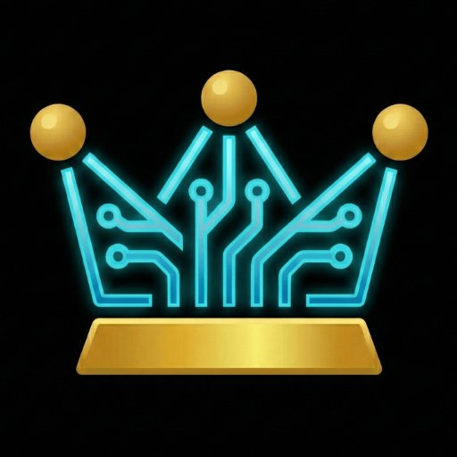

<!--
  ╔══════════════════════════════════════════════════════════════╗
  ║           EMPIRE AI TECH · VEER AKASH · GITHUB PROFILE      ║
  ║           Theme: Empire Sovereign (Custom Brand)             ║
  ╚══════════════════════════════════════════════════════════════╝
-->

<div align="center">

<!-- Animated header wave (decorative only, name is always real text below) -->


</div>

<!-- ═══════════ HERO ═══════════ -->

<div align="center">

<a href="https://empireaitech.com" title="Empire AI Tech">
  
</a>

<h1>
  
</h1>

<p>
  
</p>

<br/>

<!-- Animated tagline that cycles -->
<a href="https://github.com/Akash-veer">
  
</a>

<br/><br/>

<!-- Status badges -->

&nbsp;

&nbsp;

&nbsp;


<br/><br/>

<!-- Primary CTAs -->
<a href="https://empireaitech.com">
  
</a>
&nbsp;
<a href="https://play.google.com/store/apps/details?id=com.empirewealth.app">
  
</a>
&nbsp;
<a href="https://www.linkedin.com/in/veer-akash-math-ai/">
  
</a>

</div>

<br/>

---

## 🏰 The Mission

I am on a mission to build the **Atmanirbhar Investor** ecosystem — bridging pure mathematics and advanced neural networks to deploy proprietary **Small Machine Learning (SML)** models that put data sovereignty and user privacy first.

The core product is a **zero-hallucination financial intelligence platform** built for the Indian retail investor. The stack includes a live Web SaaS (AI Stock Reports · SWOT · Concall Summaries · Discovery Engine), the **Empire Wealth** personal finance OS on Google Play, and a proprietary Two-Lane inference backend engineered to solve the cost-of-inference problem at scale.

<div align="center">

| 🌐 Web SaaS | 📱 Mobile | 🤖 AI Architecture |
|:---:|:---:|:---:|
| [Empire AI Tech](https://empireaitech.com) — AI Stock Intelligence | [Empire Wealth](https://play.google.com/store/apps/details?id=com.empirewealth.app) — Personal Finance OS | BitNet b1.58 · LoRA · Sovereign SLM |

</div>

---

## ⚡ Two-Lane AI Architecture

```
┌──────────────────────────────────────────────────────────────────┐
│                      INTELLIGENCE ROUTER                         │
├───────────────────────────────┬──────────────────────────────────┤
│  LANE 1  ·  HEAVY COMPUTE     │  LANE 2  ·  INTERACTIVE COMPUTE  │
│  Gemini 2.5 Flash             │  Proprietary Sovereign SLM       │
│                               │  BitNet b1.58 · LoRA Fine-tuned  │
│  · Deep SWOT generation       │  · Platform help & onboarding    │
│  · Concall AI summaries       │  · Concall Q&A (post-summary)    │
│  · News × Math synthesis      │  · Financial term explanations   │
│  · Future: Multimodal chart   │  · Near-zero token cost at scale │
│    visual analysis            │  · India AI Mission aligned      │
└───────────────────────────────┴──────────────────────────────────┘
  4-Phase Blueprint: Dataset → LoRA → bitnet.cpp → pgvector Cache
```

> *"Static data cached once, served free. Dynamic hyper-personalised queries are the real compute problem — and we're engineering it away."*

---

## 🛠️ Tech Stack

<div align="center">

**Languages & Frameworks**

[](https://skillicons.dev)

**AI / ML**

[](https://skillicons.dev)

**Infrastructure & Tools**

[](https://skillicons.dev)

</div>

<div align="center">


</div>

---

## 📊 GitHub Analytics

<div align="center">
  
  
</div>

<div align="center">
  
</div>

<div align="center">
  
</div>

---

## 🚀 Currently Building

| Status | Project | Description |
|:---:|---|---|
| 🟡 **90%** | **Empire AI Tech Web SaaS** | AI Stock Reports · Concall Summaries · Discovery Engine · SWOT Analysis. Public launch imminent. |
| 🟢 **Live** | **Empire Wealth** | [Available on Google Play](https://play.google.com/store/apps/details?id=com.empirewealth.app). Personal finance OS built 100% offline, privacy-first. |
| 🏆 **Hackathon** | **Anthropic Hackathon** | Educational Data Forge for SEBI/NISM certification knowledge bases, built with Claude Opus 4. |
| 🔬 **Research** | **Sovereign SLM** | LoRA fine-tuning BitNet b1.58 on Vertex AI A100 for near-zero interactive inference. |

---

## 📫 Let's Connect

<div align="center">

[](mailto:akash@empireaitech.com)
&nbsp;
[](https://www.linkedin.com/in/veer-akash-math-ai/)
&nbsp;
[](https://empireaitech.com)

<br/>


</div>

---

<div align="center">
  <em>"I didn't outsource the math. I built it."</em>
  <br/>
  <strong>— The Empire AI Founding Principle</strong>
</div>

<br/>

<div align="center">

</div>
